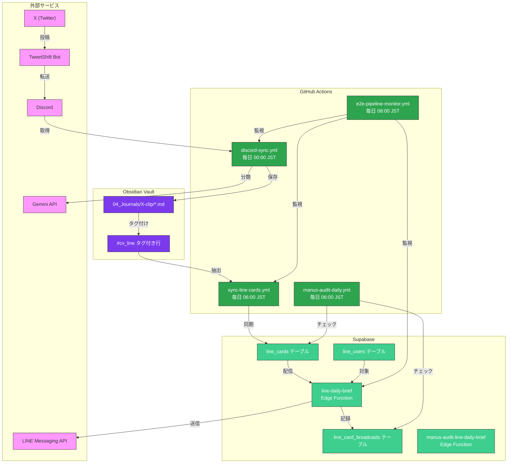
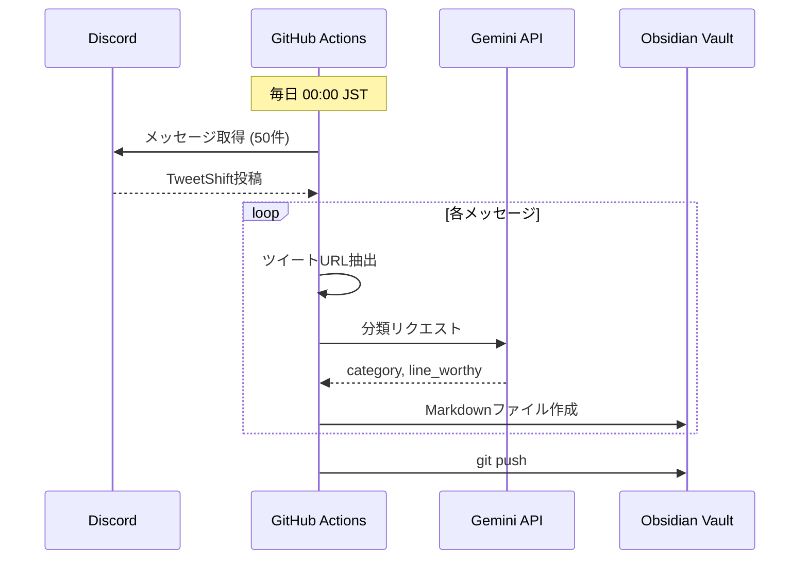
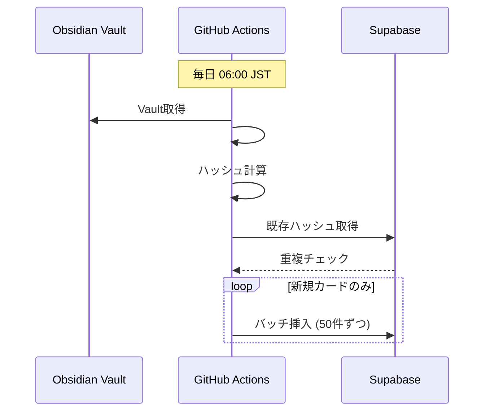
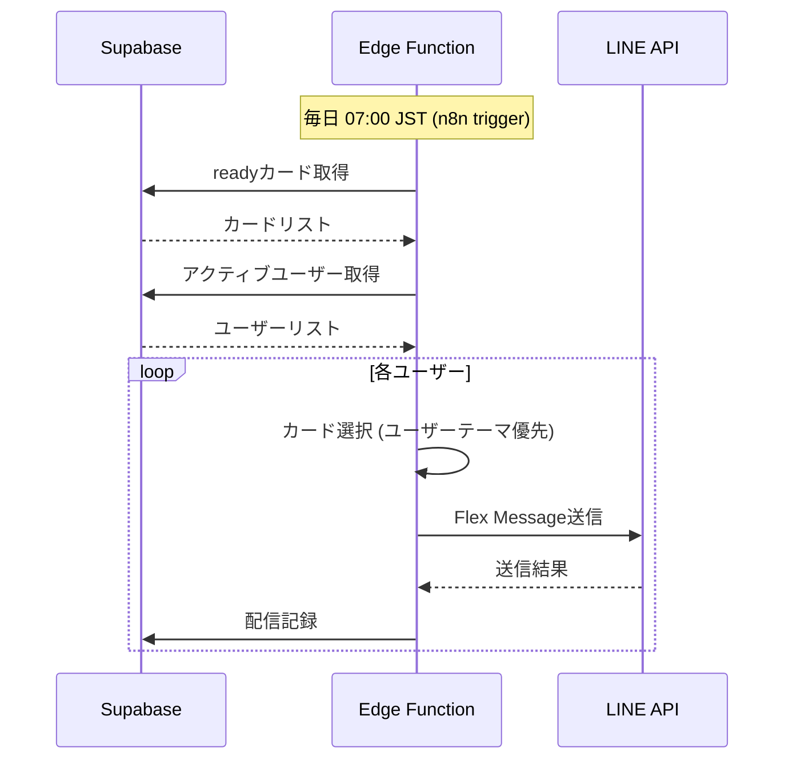
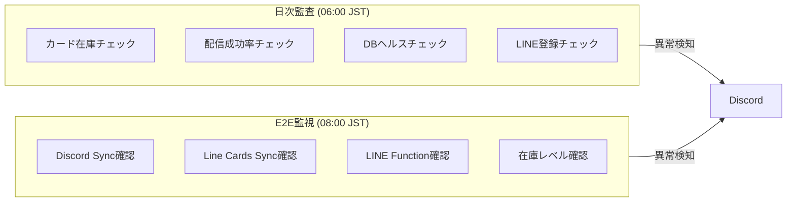
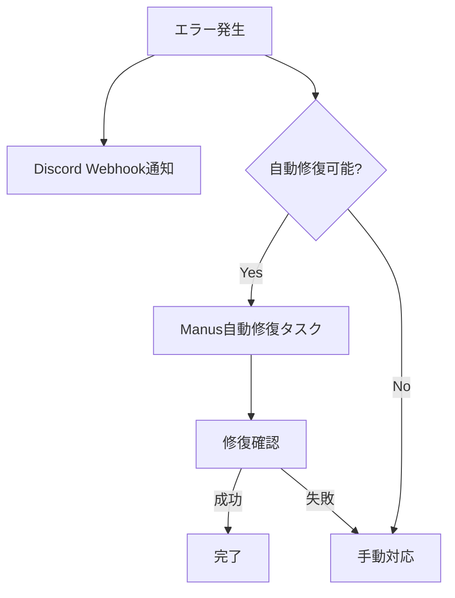

# X → LINE データパイプライン アーキテクチャ

## 概要

X（Twitter）投稿 → Discord → Obsidian → Supabase → LINE という一連のデータフローを自動化したシステム。

## システム全体図

## コンポーネント詳細

### 1. Discord → Obsidian 同期

#### 関連ファイル
- `.github/workflows/discord-sync.yml`
- `.scripts/classify_tweet.py`
- `.scripts/extract_tweet.py`

### 2. Obsidian → Supabase 同期

#### 関連ファイル
- `.github/workflows/sync-line-cards.yml`
- `scripts/export-line-cards/src/main.ts`
- `scripts/export-line-cards/src/extractor.ts`
- `scripts/export-line-cards/src/supabase-client.ts`

### 3. Supabase → LINE 配信

#### 関連ファイル
- `supabase/functions/line-daily-brief/index.ts`

### 4. 監視システム

## スケジュール

| 時刻 (JST) | ワークフロー | 内容 |
|------------|--------------|------|
| 00:00 | discord-sync | X投稿をObsidianに同期 |
| 06:00 | sync-line-cards | ObsidianカードをSupabaseに同期 |
| 06:00 | manus-audit-daily | 日次監査実行 |
| 07:00 | n8n → line-daily-brief | LINE配信実行 |
| 08:00 | e2e-pipeline-monitor | E2Eパイプライン監視 |

## エラー通知フロー

## 改訂履歴

| 日付 | 内容 |
|------|------|
| 2024-12-20 | 初版作成 |
