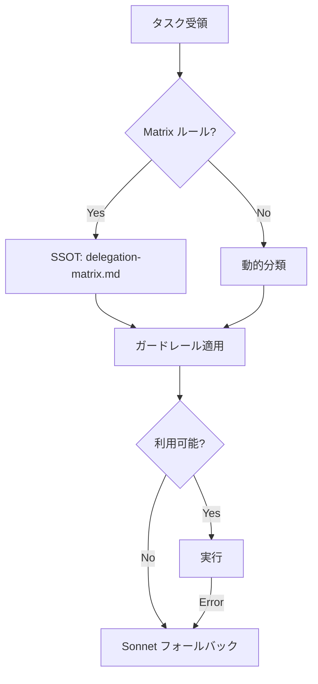

# Cursorvers Platform 開発ロードマップ 2026

**作成日**: 2026-02-01
**Status**: Weekly Limit リセット直後（最適な実装タイミング）

---

## 完了済みマイルストーン（2026-01 〜 2026-02-01）

### ✅ Phase 0: 性能/DB（2026-01-08 完了）
- RLS ポリシーのサブクエリ化
- 未使用インデックス削除
- VACUUM ANALYZE 実施

### ✅ Phase 1: Stripe E2E（2026-01-08 完了）
- Checkout → Webhook → DB 更新フロー確立
- イベント記録システム構築

### ✅ Phase 2: LINE Bot 最適化（2026-02-01 完了）
- GitHub Actions ワークフロー削減（36 → 29）
- 19.4% 効率化達成

---

## CRITICAL Priority: デュアルパス型ルータ実装

**Status**: 設計完了、次セッション実装予定
**影響度**: 最大（Claude 98%問題の根本解決）

### 問題の本質

```
全タスク → Claude（手動判断）
    ↓
Weekly Limit 98% 到達
    ↓
固定費モデル（Codex $200/月）未活用
    ↓
コスト効率: $13.33/タスク（非効率）
```

### 解決策



### 4層オーケストレーション

| Layer | モデル | 用途 | コスト | 目標使用 |
|-------|--------|------|--------|---------|
| 1 | Codex | コード・設計 | 固定 $200/月 | 80-100回/週 |
| 2 | GLM-4.7 | 軽量・明確 | 固定 $15/月 | 100回/週 |
| 3 | Haiku | 超軽量 | 従量 | 20-30回/週 |
| 4 | Sonnet | 複雑・高リスク | 従量 | 10-15回/週 |

### 実装計画

**Phase 1**: シャドールーティング（1週間）
```bash
# ルータを実行するが、結果をログのみ
# 既存ワークフローへの影響なし
```

**Phase 2**: Layer 1 有効化（2週間）
```bash
# Codex のみ有効化
# 問題なければ Layer 2-3 へ
```

**Phase 3**: 完全移行
```bash
# 全レイヤー有効化
# メトリクスダッシュボード整備
```

**推定実装時間**: 1-2時間（コーディング）+ 3週間（検証）

### 期待効果（1ヶ月後）

| 指標 | Before | After | 改善率 |
|------|--------|-------|--------|
| Claude 使用率 | 98% | 35% | **64%削減** |
| Codex 使用 | 15回/週 | 80-100回/週 | **6倍増** |
| GLM 使用 | 74回/週 | 100回/週 | 35%増 |
| コスト効率 | $13.33/タスク | $2.00/タスク | **85%削減** |

**参照**: `orchestration/NEXT_SESSION_PLAN.md`

---

## Phase 3: 動画生成スキル化（NEW）

**Status**: 設計フェーズ
**優先度**: HIGH
**技術債務**: 手動オペレーション過多

### 現状分析

**プロジェクト**:
- `~/Dev/telop-pack-srt-02/` (Remotion v4.0.377)
  - 6種類のエフェクト付きテロップ生成
  - Manus 対応済み
  - Ubuntu サンドボックス動作確認済み

**問題**:
- Claude Code から直接呼び出し不可
- 手動で npm コマンド実行が必要
- スタイル選択が煩雑

### 実装計画

#### Task 3-1: Remotion スキル作成

```bash
# スキル構造
~/.claude/skills/remotion-video/
├── SKILL.md              # スキル定義
├── scripts/
│   ├── render-telop.js   # SRT → テロップ動画
│   ├── render-promo.js   # データ → プロモ動画
│   └── validate-srt.js   # SRT 検証
└── templates/
    └── config.json       # デフォルト設定
```

**トリガー**:
- `動画を作成して`, `テロップを生成`, `SRTから動画`, `プロモ動画`

**委譲**:
- 設計: Codex architect
- 実装: Codex code-reviewer
- レンダリング: Remotion CLI

**推定時間**: 2-3時間

---

#### Task 3-2: GitHub Actions ワークフロー統合

```yaml
# .github/workflows/video-generation.yml
name: Video Generation

on:
  workflow_dispatch:
    inputs:
      srt_file: {description: 'SRT file path', required: true}
      video_file: {description: 'Video file path', required: true}
      style:
        description: 'Telop style'
        type: choice
        options: [01-neonpop, 02-softcard, 03-cinematic, ...]

jobs:
  render:
    runs-on: ubuntu-latest
    steps:
      - uses: actions/checkout@v4
      - uses: actions/setup-node@v4
      - run: npm install
      - run: npm run prepare
      - run: npm run render:${{ inputs.style }}
      - uses: actions/upload-artifact@v4
        with:
          name: video-output
          path: out/*.mp4
```

**推定時間**: 1時間

---

#### Task 3-3: ドキュメント・プレゼン連携

**統合方針**:
```
Remotion (動画) + generate-slides (スライド) = 統合プレゼンシステム
```

**ユースケース**:
1. `generate-slides.ts` でスライド生成
2. 各スライドをキャプチャ
3. Remotion でアニメーション付き動画化
4. NotebookLM と連携

**推定時間**: 3-4時間

---

### Phase 3 完了条件

- [ ] Remotion スキル作成完了
- [ ] GitHub Actions ワークフロー追加
- [ ] delegation-matrix.md 更新
- [ ] テスト動画生成成功

---

## Phase 4: Cursorvers Web (toB Platform) 強化

**Status**: 企画フェーズ
**優先度**: MEDIUM
**対象**: `cursorvers_web/` (Next.js 16)

### 実装予定機能

#### 4-1: ClientOps モジュール強化
- プロジェクト管理 UI 改善
- タスク進捗可視化
- アーティファクト管理

#### 4-2: Audit モジュール UI
- 監査セッション作成
- 証跡収集インターフェース
- PDF レポート生成

#### 4-3: Stripe サブスクリプション
- 定期課金フロー
- プラン変更 UI
- 請求履歴表示

**推定時間**: 10-15時間

---

## Phase 5: Discord Bot 拡張

**Status**: 企画フェーズ
**優先度**: LOW

### 実装予定機能

- `/status` コマンド（会員ステータス確認）
- `/support` コマンド（サポートチケット作成）
- 自動ロール付与の改善
- Discord → LINE 双方向連携

**推定時間**: 5-8時間

---

## スケジュール（2026-02 〜 2026-03）

```
Week 1 (2026-02-01 〜 2026-02-07)
├── デュアルパス型ルータ実装（CRITICAL）
└── シャドールーティング開始

Week 2 (2026-02-08 〜 2026-02-14)
├── Remotion スキル作成開始
└── Layer 1 有効化検証

Week 3 (2026-02-15 〜 2026-02-21)
├── Remotion GitHub Actions 統合
└── Layer 2-3 有効化

Week 4 (2026-02-22 〜 2026-02-28)
├── ドキュメント連携実装
└── 全レイヤー完全移行

Week 5+ (2026-03-)
└── Phase 4: Cursorvers Web 強化開始
```

---

## リスク管理

| リスク | 影響 | 緩和策 |
|--------|------|--------|
| ルータ誤分類 | タスク非効率 | Sonnet フォールバック |
| Weekly Limit 再超過 | 開発停滞 | 4層分散で予防 |
| Remotion レンダリング失敗 | 動画生成不可 | ローカルフォールバック |

---

## 成功指標

### 2026-02 末時点

| 指標 | 目標 |
|------|------|
| Claude 使用率 | ≤ 35% |
| Codex 使用 | ≥ 80回/週 |
| GLM 使用 | ≥ 100回/週 |
| Remotion スキル | 稼働中 |

### 2026-03 末時点

| 指標 | 目標 |
|------|------|
| 動画生成自動化 | 100% |
| Cursorvers Web 新機能 | 3件以上 |
| システム総合評価 | 9.5/10 → 10/10 |

---

**Next Action**: `orchestration/NEXT_SESSION_PLAN.md` を読んでルータ実装開始
